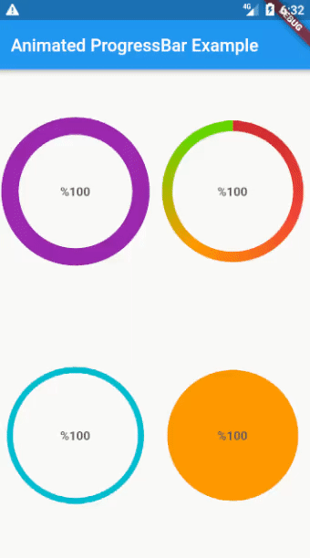

## Animated Progress Bar
A Flutter plugin to show animated progress bar with customization styles. 



### Getting Started
In order to use this package, do import
```dart
import 'package:animated_progress_bar/animated_progress_bar.dart';
```

You can simply use this plugin as follows:
```dart
import 'package:animated_progress_bar/animated_progress_bar.dart';
import 'package:flutter/material.dart';

void main() {
  runApp(const MyApp());
}

class MyApp extends StatefulWidget {
  const MyApp({super.key});

  @override
  State<MyApp> createState() => _MyAppState();
}

class _MyAppState extends State<MyApp> {
  @override
  Widget build(BuildContext context) {
    return MaterialApp(
      home: Scaffold(
        appBar: AppBar(
          title: const Text('Animated ProgressBar Example'),
        ),
        body: const SizedBox(

                      /// set the [width] and [height] of the displayable area
                      height: 150,
                      width: 150,
                      child: AnimatedProgressBar(
                        /// set [stroke]
                        stroke: 20,

                        /// set the [foreground color] of the progress bar
                        color: Colors.purple,

                        /// The progress bar style can be [stroke] or [fill]
                        style: PaintingStyle.stroke,

                        /// Percentage progress is a number between [0] and [1], for example, to display [50] percent of the graph, this number must be [0.5].
                        percentage: 1,
                      ))
      ),
    );
  }
}
```

### License
MIT

### About
Built with <3   
by Mostafa Efafi  
